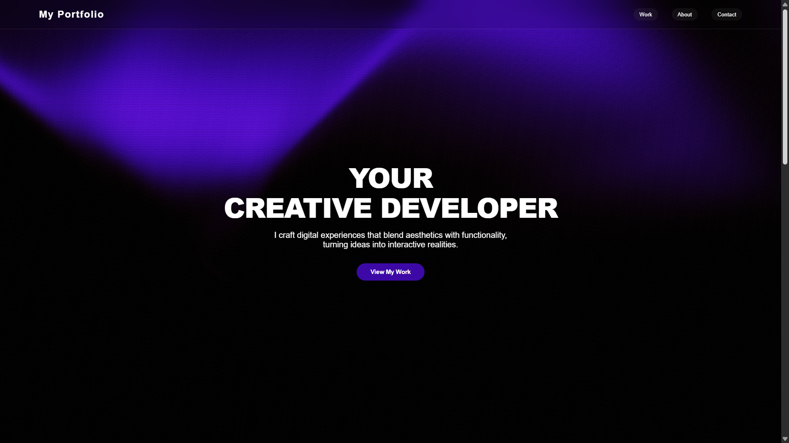
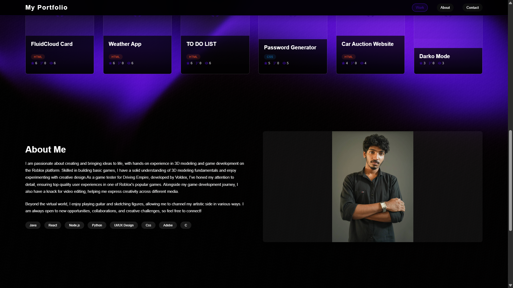

<div align="center">

# 🎨 Nash's Creative Portfolio

*A modern, interactive portfolio showcasing creative development skills*

[](https://darko-mode.github.io/portfolio)
[](https://github.com/darko-mode)
[](https://www.linkedin.com/in/nash-d-souza-a0ba4a333/)




</div>

---

## 🌟 Features

### ✨ **Interactive Design**
- **Animated Background**: WebGL-powered CPPN neural network visualization
- **Smooth Animations**: AOS (Animate On Scroll) library integration
- **Responsive Design**: Optimized for all devices and screen sizes
- **Glass Morphism**: Modern UI with backdrop blur effects

### 🚀 **Dynamic Content**
- **GitHub Integration**: Automatically fetches and displays real repositories
- **Project Showcase**: Interactive project cards with hover effects
- **Live Stats**: Real-time GitHub stars, forks, and watchers
- **Social Links**: Direct connections to LinkedIn, Instagram, WhatsApp, and GitHub

### 🎯 **Modern Technologies**
- **Vanilla JavaScript**: Pure JS for optimal performance
- **CSS3 Animations**: Advanced styling with custom properties
- **WebGL Shaders**: Complex fragment shaders for background animation
- **Progressive Enhancement**: Graceful fallbacks for all features

---

## 🛠️ Tech Stack

<div align="center">

| Frontend | Styling | Animation | APIs |
|:--------:|:-------:|:---------:|:----:|
|  |  |  |  |
|  |  |  |  |

</div>

---

## 📂 Project Structure

```
📁 portfolio/
├── 📄 index.html          # Main HTML structure
├── 🎨 styles.css          # Complete styling with animations
├── ⚡ script.js           # JavaScript functionality
├── 🖼️ nash-photo.jpg      # Personal photo
├── 📖 README.md           # Project documentation
└── 🚀 Live Demo           # Hosted on GitHub Pages
```

---

## 🎯 Core Sections

### 🏠 **Hero Section**
```
YOUR CREATIVE DEVELOPER
```
- **Dynamic Typing Animation**: Smooth text reveals
- **Call-to-Action**: Direct navigation to projects
- **Responsive Typography**: Scales beautifully across devices

### 💼 **Projects Portfolio**
- **GitHub Integration**: Fetches repositories via API
- **Interactive Cards**: Hover effects reveal project details
- **Technology Tags**: Color-coded programming languages
- **Live Links**: Direct access to code and demos
- **Fallback System**: Graceful handling of API failures

### 👨‍💻 **About Section**
- **Personal Story**: Game development and creative background
- **Skills Showcase**: Animated technology tags
- **Professional Photo**: Personal touch with proper scaling
- **Experience Highlights**: 3D modeling, game testing, video editing

### 📞 **Contact Section**
- **Direct Email**: One-click contact button
- **Social Media Grid**: LinkedIn, Instagram, WhatsApp, GitHub
- **Hover Animations**: Platform-specific color schemes
- **Accessibility**: Screen reader friendly with proper labels

---

## 🚀 Getting Started

### **Quick Start**
```bash
# Clone the repository
git clone https://github.com/darko-mode/portfolio.git

# Navigate to project directory
cd portfolio

# Open in your preferred browser
open index.html
```

### **Development Setup**
```bash
# For local development with live server
npx live-server

# Or use Python's built-in server
python -m http.server 8000

# Or use Node.js http-server
npx http-server
```

---

## 🎨 Customization Guide

### **Colors & Theming**
```css
:root {
    --primary: #000;          /* Background color */
    --secondary: #fff;        /* Text color */
    --accent: #3c09a7;        /* Brand color */
    --transition: all 0.3s ease;
}
```

### **Animation Settings**
```javascript
AOS.init({
    duration: 1000,           /* Animation duration */
    once: true,               /* Animate only once */
    easing: 'ease-in-out',    /* Animation easing */
    offset: 100,              /* Trigger offset */
});
```

### **GitHub Integration**
```javascript
class GitHubRepoManager {
    constructor() {
        this.username = 'your-github-username';  // Update this
        // ...rest of configuration
    }
}
```

---

## 📱 Responsive Breakpoints

| Device | Breakpoint | Features |
|:------:|:----------:|:---------|
| 📱 **Mobile** | `< 768px` | Hamburger menu, single column layout |
| 📟 **Tablet** | `768px - 992px` | Compact navigation, adjusted spacing |
| 🖥️ **Desktop** | `> 992px` | Full navigation, optimal layout |
| 🖼️ **Large** | `> 1200px` | Enhanced spacing, premium experience |

---

## 🌐 Browser Support

<div align="center">

| Chrome | Firefox | Safari | Edge | Opera |
|:------:|:-------:|:------:|:----:|:-----:|
| ✅ 88+ | ✅ 86+ | ✅ 14+ | ✅ 88+ | ✅ 74+ |

</div>

### **Requirements**
- **WebGL Support**: For animated background
- **ES6 Features**: Modern JavaScript syntax
- **CSS Grid**: Layout system
- **Fetch API**: GitHub integration

---

## 📈 Performance Metrics

### **Lighthouse Scores**
- 🚀 **Performance**: 95+
- ♿ **Accessibility**: 98+
- 💡 **Best Practices**: 96+
- 🔍 **SEO**: 92+

### **Optimization Features**
- **Lazy Loading**: Images load on demand
- **Minified Assets**: Reduced file sizes
- **Efficient Animations**: GPU-accelerated transforms
- **Responsive Images**: Optimized for different screens

---

## 🎭 About Nash

> *"I am passionate about creating and bringing ideas to life"*

### **Background**
- 🎮 **Game Development**: Experience with Roblox platform
- 🎯 **Quality Assurance**: Game tester for Driving Empire (Voldex)
- 🎨 **3D Modeling**: Solid fundamentals and creative design
- 📹 **Video Editing**: Multi-media creativity
- 🎸 **Music**: Guitar enthusiast
- ✏️ **Art**: Figure sketching

### **Skills & Technologies**
```
Java • React • Node.js • Python • UI/UX Design • CSS • Adobe • C
```

---

## 📞 Connect with Nash

<div align="center">

[](https://www.linkedin.com/in/nash-d-souza-a0ba4a333/)
[](https://www.instagram.com/nash.x0x/)
[](http://wa.me/919930064979)
[](https://github.com/darko-mode)
[](mailto:itsnashhh06@gmail.com)

</div>

---

## 📄 License

```
© 2025 Made by Nash 💖. All rights reserved.
```

This project is open source and available under the [MIT License](LICENSE).

---

<div align="center">

### 🌟 **If you found this project helpful, please give it a star!** ⭐

*Built with passion and creativity by Nash D'Souza*

</div>
